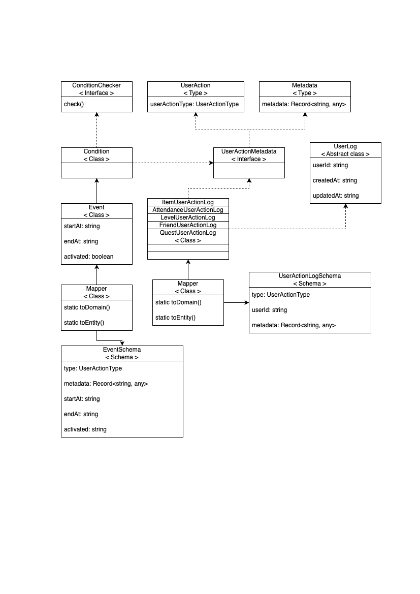

# event-reward-platform

과제 수행자: 김현중(hjk0761@naver.com)

## 목차

1. [실행 방법](#실행-방법)
2. [기능 명세](#기능-명세)
3. [API 명세](#api-명세)
4. [아키텍처 구조](#아키텍처-구조)
5. [고민 포인트 및 아쉬운 점](#고민-포인트-및-아쉬운-점)

## 실행 방법
```
git clone https://github.com/hjk0761/event-reward-platform.git
cd event-reward-platform
docker-compose up --build
```

## 기능 명세

### Gateway Server

- [x] Passport 및 Guard 를 사옹하여 인증/인가
- [x] API 라우팅
- [x] JWT 검증

### Auth Server

- [x] 유저 등록
- [x] 로그인
    - JWT 토큰 생성
- [x] 역할 관리(USER, OPERATOR, AUDITOR, ADMIN)
    - 유저 역할 수정(접근: ADMIN)

### Event Server

- [x] 이벤트 생성(접근: ADMIN, OPERATOR)
- [x] 이벤트 조회(접근: ADMIN, OPERATOR)
- [x] 보상 생성(접근: ADMIN, OPERATOR)
- [x] 보상 조회(접근: ADMIN, OPERATOR)
- [x] 유저 보상 요청(접근: USER)
- [x] 보상 요청 내역 확인(접근: ADMIN, OPERATOR, AUDITOR)
- [x] 보상 요청 내역 확인(접근: USER)

## API 명세


## 아키텍처 구조

### 서비스 설계

서비스는 요구사항과 같이, Docker 를 사용하여 총 3개의 서버를 띄우고 Gateway 서버를 통해 모든 서버로 진입할 수 있도록 구현했습니다.


구현하면서 고민이 된 부분은 다음과 같습니다.

1. Game Server 의 분리

실제 서비스에선 라이브 서비스에서 쌓인 로그를 확인하며 이벤트 설계 및 보상 요청을 지원할 것이라고 생각했고, 이로 인해 라이브 서비스가 분리되어 있을 것이라고 생각했습니다.

다만, 과제를 수행하면서 새로운 서버를 만드는 것이 요구사항을 벗어나는 일이라고 판단했습니다.

만약 지금 상황에서 서버를 분리한다면 Event 서비스의 src/user-action 패키지가 라이브 서비스로 분리되고, 해당 서버로부터 유저 로그를 찾는 기능이 추가되어야 한다고 생각했습니다.

2. 서버 분리로 인한 공통 도메인 관리

Shared 패키지를 프로젝트 최상단에 두고, 각 서비스마다 공유되는 도메인(UserActionType, Role 등)을 import 해서 사용하는 방안을 고민했습니다.

각 서비스마다 담당하는 팀이 다를 것이고, api 스펙을 맞추는 것 이전에 공통 도메인을 정의하고 사용해야 할 것입니다.

이를 위해 현업에서 어떻게 공통 자원을 공유하는지 궁금증이 생겼습니다.

공유할 도메인이 작다면 앞서 말한것처럼 Shared 패키지를 통해 공유할 수 있을 것이고, 공유할 도메인이 크다면 npm 로컬 라이브러리로 묶을 수도 있을 것이라고 생각했습니다.

### Event 및 Reward 도메인 설계

이벤트 및 보상 도메인 설계는 다음과 같습니다.



전체적인 틀은 메이플스토리 PC를 참고하여 구현하였습니다.

다른 부분은, 메이플스토리 PC는 `계정 1:n 캐릭터, 캐릭터 1:n 로그`와 같은 구조를 띄고있지만 구현한 과제에선 해당 도메인을 축소시켜 `유저 1:n 로그`로 가정했습니다.

이벤트와 보상을 정의하기 이전에 먼저 `레벨, 아이템, 출석, 퀘스트, 친구` 와 같이 크게 다섯가지로 유저의 행동을 정의했습니다.

유저의 로그를 기반으로 이벤트 조건을 판별할 수 있도록 `ConditionChecker.check()` 메서드를 구현하도록 설게했습니다.

이벤트는 앞서 정의한 유저의 행동을 기반으로 6가지로 정리했습니다.

`레벨 업 n회, n레벨 도달, 친구 n명 추가, n일 출석, 특정 아이템 n개 획득, 특정 퀘스트 클리어`로 정의하였고, 이에 따라 각각의 Condition 클래스를 구현하여 Event 객체로 넣어주었습니다.

이렇게 설계한 이유는 유저의 행동이 다양화 될수록, 이에 따라 이벤트 달설 조건으로 사용할 수 있는 조건도 다양화되기 때문입니다.

미리 정의된 이벤트, 유저의 행동은 실제 서비스에 비해 정말 간략화된 부분이고, 이 구조를 기반으로 다양한 행동을 직접 정의하고 검증할 수 있도록 인터페이스 및 타입, 추상 클래스를 사용하여 추상화 시켰습니다.

## 고민 포인트 및 아쉬운 점

아래는 과제를 구현하면서 고민했던 점, 구현하면서 고려했던 점, 아쉬운 점을 정리한 부분입니다.

1. 토큰 관리 정책: RefreshToken Rotation 적용

JWT 토큰을 통해 인증인가를 진행하는 시점에서 AccessToken 과 RefreshToken을 분리하였고, RefreshToken Rotation 을 적용했습니다.

실제 게임 서비스를 만든다는 고민에서 이렇게 구현하게 되었습니다.

토큰을 분리한 이유는 수명이 다른 토큰을 두면서 토큰 탈취로 인한 비정상적인 접근을 막으면서 유저가 토큰을 사용하는 서비스(로그인 이후 모든 api 호출)에 있어 짧은 시간의 엑세스 토큰 만료로 인해 불편함을 느끼지 않는 것이 목표였기 때문입니다.

지금처럼 라이브 서비스와 모니터링 서비스가 같이 존재한다고 가정하면, 유저(게이머)는 유저대로, 모니터링 및 관리자는 각자대로 일정 시간 이후 접속이 자동으로 끊어지는 상황에서 큰 불편함을 느낄 것입니다.

그러면서 보안적인 부분을 챙기기 위해서 RefreshToken을 발급하고 저장하는 동작에서 DB connection 이 자주 생기는 단점보다 장점이 크다고 생각해 구현하게 되었습니다.

2. Transaction 관리

MongoDB는 단일 문서 작업에선 원자성을 보장해주지만, Event 서비스의 보상 요청과 같은 부분은 여러 문서 작업이 동시에 포함된 작업입니다.

이들의 원자성을 보장하기 위해선 이미 구현된 `@Transactional()` 데코레이터를 적용하고 세션을 mongoose 메서드에 주입하여 수행할 수 있습니다.

하지만, replica set 이 아닌 mongoDB 설정에서는 해당 원자성 보장 과정이 적용되지 않음을 알게되었고, 이에 따라 원자성 구현은 롤백하게 되었습니다.

차후 DB 설정을 바꿔 replica set을 사용하게 된다면 해당 데코레이터를 적용하여 다중 문서 작업에서도 원자성을 보장할 수 있을 것입니다.

3. 테스트 코드

테스트 코드는 작성하지 못했습니다.

웹 백엔드 개발을 Java 및 Spring framework를 사용한 경험밖에 없어 테스트 라이브러리에 익숙하지 못해 구현할 시간이 없었습니다.

각 서비스, 기능 사이에 책임 분리를 신경쓰면서 기능 개발을 수행했기 때문에 단위 테스트가 추가되어도 문제없이 동작할 것입니다.

4. 로깅

실제 서비스였다면 Gateway 서비스를 구현하면서, 모든 요청이 해당 서비스를 통해 라우팅되기 때문에, 요청의 성공 및 실패, 그리고 요청의 주체와 응답 등을 로깅해야 된다고 생각했습니다.

다만, 3번과 같은 이유에서 시간 부족으로 인해 로깅을 구현하지 못했습니다.

제공하는 라이브러리를 이용해 요청마다 AOP 로 로깅을 적용한다면, Gateway 서비스로서의 역할을 잘 수행하게 될 것이라고 생각합니다.

5. 요청 검증

`metadata: Record<string, any>`를 사용하는 모든 객체에서 객체를 생성하는 시점에서 검증을 수행하지 못했습니다.

DTO를 검증하는 과정과 같이 AOP를 적용한 데코레이터를 구현해서, 타입에 맞는 metadata의 key가 있는지를 검증하는 과정을 통해 각 서비스의 완성도를 높일 수 있을 것입니다.