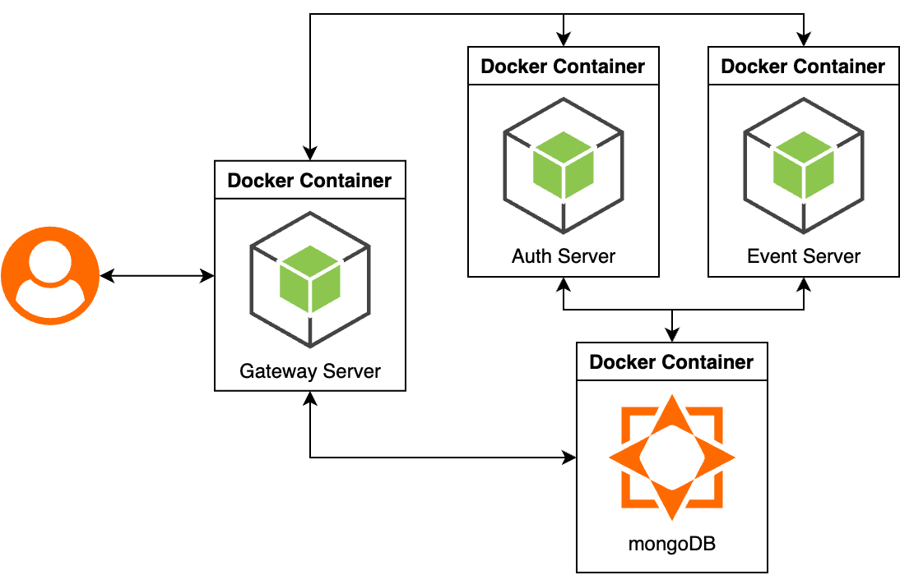

# event-reward-platform

과제 수행자: 김현중(hjk0761@naver.com)

## 실행 방법
```
git clone https://github.com/hjk0761/event-reward-platform.git
cd event-reward-platform
docker-compose up --build
```

## 기능 명세

### Gateway Server

- [x] Passport 및 Guard 를 사옹하여 인증/인가
- [x] API 라우팅
- [x] JWT 검증

### Auth Server

- [x] 유저 등록
- [x] 로그인
    - JWT 토큰 생성
- [x] 역할 관리(USER, OPERATOR, AUDITOR, ADMIN)
    - 유저 역할 수정(접근: ADMIN)

### Event Server

- [x] 이벤트 생성(접근: ADMIN, OPERATOR)
- [x] 이벤트 조회(접근: ADMIN, OPERATOR)
- [x] 보상 생성(접근: ADMIN, OPERATOR)
- [x] 보상 조회(접근: ADMIN, OPERATOR)
- [x] 유저 보상 요청(접근: USER)
- [x] 보상 요청 내역 확인(접근: ADMIN, OPERATOR, AUDITOR)
- [x] 보상 요청 내역 확인(접근: USER)

## API 명세

## 아키텍처 구조


